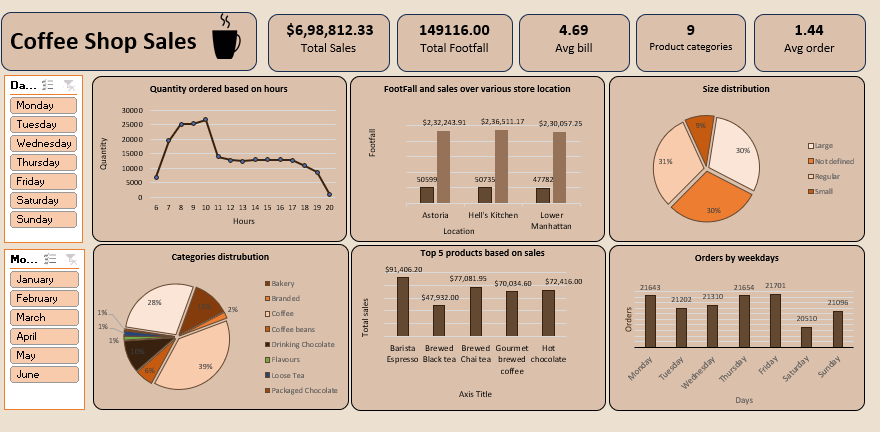

# Coffee-Shop-Sales-Analysis

**Objective:**

The main objective of this project is to analyze sales data to gain actionable insights that will enhance the performance of the Coffee Shop

**Overview:** 

This project showcases a Coffee Shop Sales Analysis Dashboard built in Excel, leveraging Power Query for data cleaning and transformation. The dashboard provides key insights into sales trends and product performance with interactive charts and KPIs.

**Process Workflow**

**Step 1: Data Collection**

Raw sales data was gathered, including transactions, product details, store locations, and order timestamps.

**Step 2: Data Cleaning using Power Query**

Clean and transform the data

Standardized column formats (dates, currency, text).

Split and merged relevant columns for better insights.

Transformed raw data into a structured format.

**Step 3: Data Analysis & Visualization**

Created Pivot Tables for key metrics.

Designed interactive charts and KPIs to visualize trends.

Used slicers for dynamic filtering (Days, Months, Product Categories).

**Step 4: Dashboard Creation**

Integrated all visuals into a user-friendly layout.

Added key performance indicators (KPIs) for Total Sales, Footfall, and Avg. Order Value.

Built comparative charts for sales by store location, product categories, and weekdays.

**Key Insights from Analysis**

Morning hours (7 AM - 10 AM) drive the highest sales.

Lower Manhattan generates high revenue despite lower footfall.

Regular and Small-sized orders are the most popular.

Barista Espresso is the best-selling product.

Weekday sales remain stable, with slight dips on weekends.

