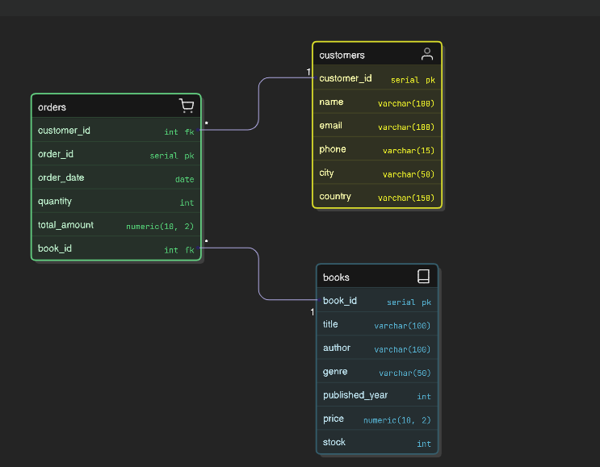

# OnlineBookStore-Analysis
**Overview**

This project is an SQL-based Online Book Store database that helps manage and analyze books, customers, and orders. 
The project includes SQL queries for inventory management, customer insights, and sales analysis.

**Database Schema**

  

**Features**

1) Book Inventory Management: Retrieve books by genre, check stock availability, and identify high-value books.
2) Customer Insights: Identify customer demographics and frequent buyers.
3) Sales Analysis: Track monthly orders, analyze high-value transactions, and assess sales trends.

**Technology Used**
MySQL for database management and retrival
